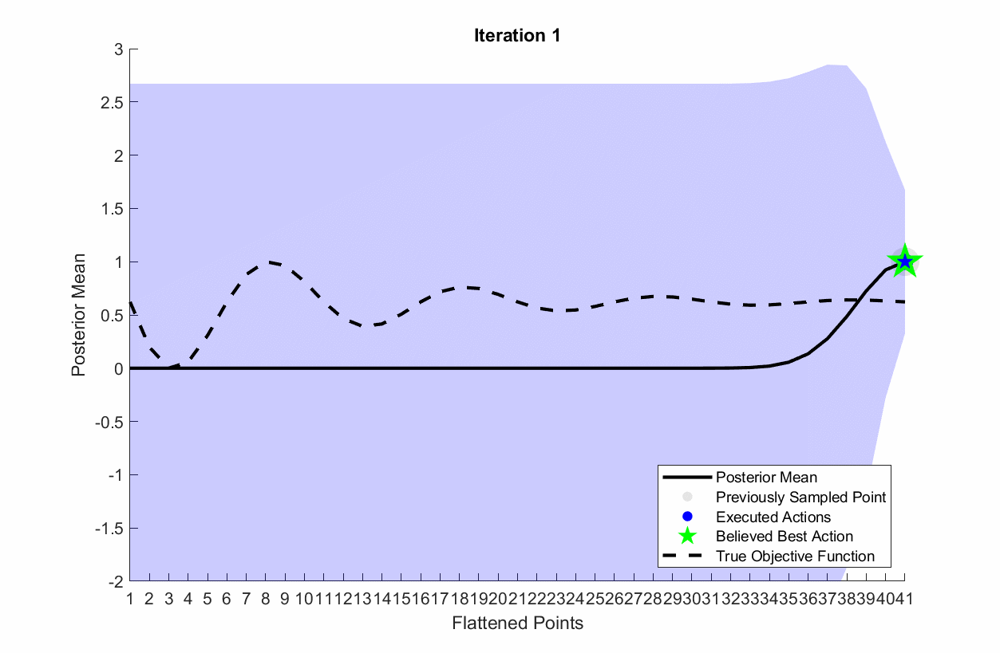
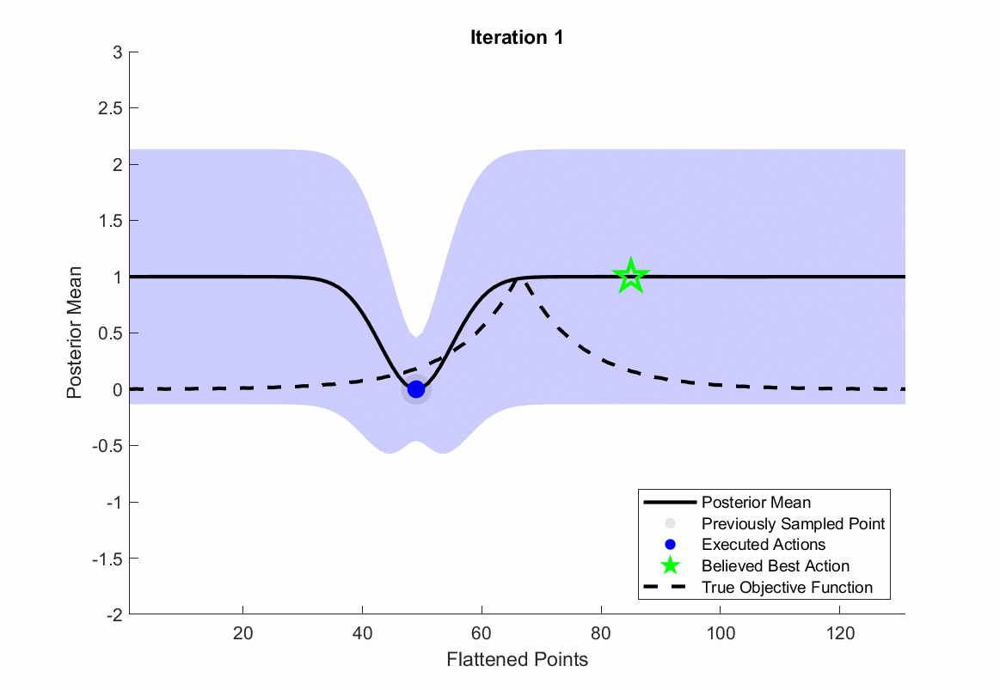
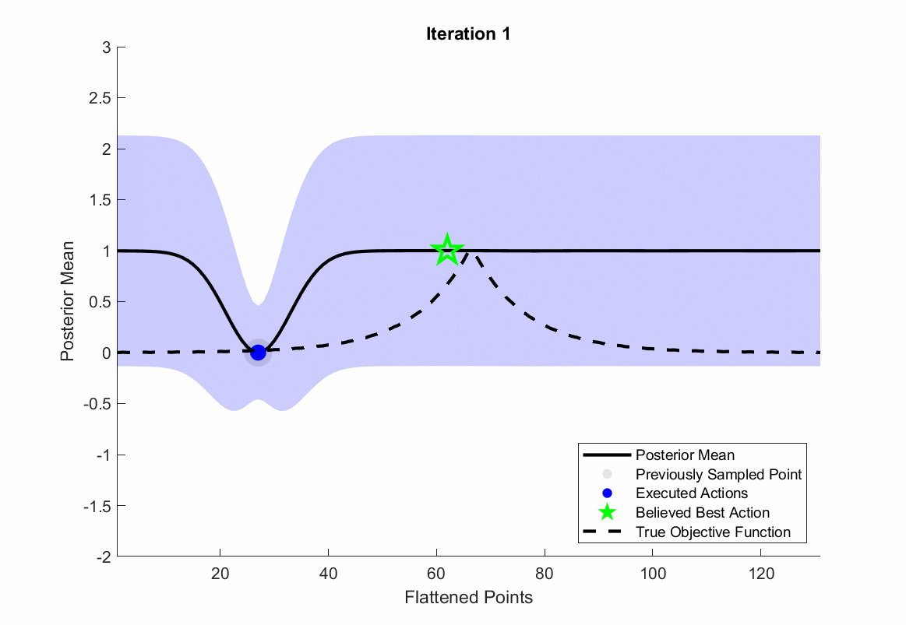

# Active Learning
Active learning is the process of estimating an unknown underlying reward function. Specific to posterior sampling methods, active learning is the process of selecting actions whose corresponding feedback informs the posterior to estimate the utility function as accurately and quickly as possible. There are several posterior sampling methods that are designed for active learning, but in POLAR we utilize information gain. Additionally, we implement a technique first introduced in the ROIAL algorithm to avoid actions with an expected ordinal label in a 'region of avoidance'.

## Information Gain
The goal of Information Gain is to select actions to execute that maximize the mutual information between the utility function and the user feedback. Formally, this is equivalent to the following optimization:

$$
a_i = \underset{a_i \in \mathcal{A}}{\text{argmax}} \quad I(\mathbf{r}, s_i, y_i | \mathbf{D}_{i-1}, a_i)
$$

where $\mathcal{A}$ is the action space, $s_i$ is the preference data between action $a_i$ and the actions it will be compared to, $y_i$ is the ordinal label of action $a_i$, and $\mathbf{D}_{i-1}$ is the the data set from the last iteration. This optimization problem can be equivalently writen in terms of information entropy:

$$
a_i = \underset{a_i \in \mathcal{A}}{\text{argmax}} \quad H(s_i,y_i | \mathbf{D}_{i-1},a_i) - \mathbb{E}_{\mathbf{r}|\bf{D}_{i-1}} [H(s_i,y_i | \mathbf{D}_{i-1},a_i,\bf{r})]
$$

where $H$ is the entropy term and represents the model's uncertainty about action $a_i$'s feedback relative to the compared actions. Maximizing information entropy is beneficial because actions with high feedback uncertainty would inform the posterior more than actions with low uncertainty. However, maximizing information entropy alone could potentially result in actions that are difficult for the human user to give feedback regarding. For this reason, the second term $(\mathbb{E}[H])$ is added to the optimization problem to put a penalty on actions that have high feedback uncertainty. In other words, this second term represents the user's 'expected uncertainty' about the feedback regarding the compared actions. In conclusion, this method of posterior sampling results in actions that are both informative and easy for the user.

A animation of information gain for the following settings is shown below:
```
obj.settings.sampling.type = 2;
obj.settings.n = 1;
obj.settings.b = 1;
obj.settings.feedback.types = [1,3];
```
{:refdef: style="text-align: center;"}

{: refdef}

## Avoiding actions in the 'Region of Avoidance' (ROA)
POLAR also includes functionality to avoid actions that are expected to have an ordinal label in a 'region of avoidance'. For example, if a problem is designed to label exoskeleton walking gaits 'very bad', 'bad', 'ok', and 'good', then the operator may want to avoid sampling 'very bad' gaits in order to avoid excessive discomfort of the human user. These actions are avoided by changing the previously mentioned information gain optimization problem to:

$$
a_i = \underset{a_i \in \mathcal{S}_{ROI}}{\text{argmax}} \quad H(s_i,y_i | \mathbf{D}_{i-1},a_i) - \mathbb{E}_{\mathbf{r}|\bf{D}_{i-1}} [H(s_i,y_i | \mathbf{D}_{i-1},a_i,\bf{r})]
$$

where $\mathcal{S}_{ROI}$ denotes the actions that are expected to be in the 'region of interest' (ROI). The ROI is defined as all actions that are outside of the ROA. This is formally defined as:

$$
\mathcal{S}_{ROI} := \{ a \in \mathcal{A} | \hat{r}(a) + \lambda \Sigma(a) > b_1 \}
$$

where $\hat{r}$ is the posterior mean, $\lambda$ is a user-defined hyperparameter that defines the upper confidence bound in determining if actions are within the ROI, $\Sigma(a)$  is the posterior covariance matrix, and $b_1$ is the threshold between the ordinal categories that separate the ROA and the ROI. 


The following are two simulations with and without the region of avoidance. The region of avoidance was configured as follows:
```
obj.settings.feedback.num_ord_categories = 5;
obj.settings.roa.use_roa = 1;
obj.settings.roa.lambda = 0.1;
obj.settings.roa.ord_label_to_avoid = 1;
```


| <center> Without ROA </center> | <center> With ROA </center> |
| | |

