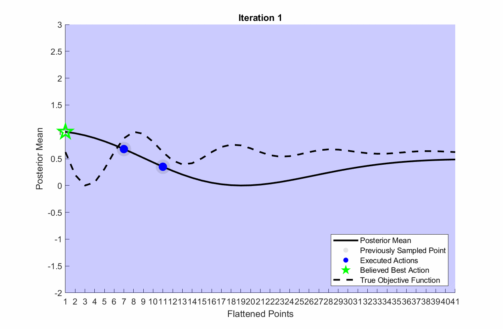

# Regret Minimization
Regret minimization is the process of selecting actions to execute on a system that minimize the cumulative regret throughout an experiment. Instantaneous regret of action $a_k$ is defined as the difference between the utility of the executed action $f(a_k)$ and the utility of the optimal action $f(a^\*)$:

$$
\text{Instantenous Regret} := f(a_k) - f(a^*).
$$

The cumulative regret (often just termed regret) is then the sum of the instantaneous regret of all N actions up to the current action:

$$
\text{Regret} := \sum_{k = 1}^N f(a_k) - f(a^*)
$$

Thus in words, regret minimization is the process of identifying and sampling the optimal action as quickly as possible.

## Thompson Sampling
There are many posterior sampling techniques designed for regret minimization. In POLAR, we utilize Thompson Sampling. The general idea of Thompson Sampling is the following:
- Draw $n$ samples $f_i$ for $i = 1, \dots, n$ from the posterior distribution $P(\bf{f} \| \bf{D})$ where $\bf{f} := [f(a_1), \dots, f(a_N)]^T$ is the vectorized utilities and $\bf{D}$ is the collected feedback. 
- Select $n$ actions $a_i$ for $i = 1, \dots, n$ to execute such that:
$$
a_i = \underset{a \in \mathcal{A}}{\text{argmax}} f_i,
$$ where $\mathcal{A}$ is the set of all actions.


## POLAR Settings
To use Thompson Sampling in POLAR, use the following setting:
	
	obj.setting.acq_type = 1;

## Thompson Sampling Example
To visualize Thompson Sampling, first change the settings of setupLearning.m in the 1D Function example to the following (n and b are optional but better for visualization):
```
settings.acq_type = 1;
settings.n = 2;
settings.b = 0;
```
Next, to run a simulation with visualization run:
```
toolbox_addpath
alg = loadExample('1D Function');
alg.runSimulation(true,false);
```
{:refdef: style="text-align: center;"}

{: refdef}

