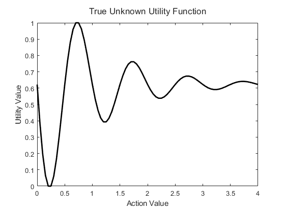
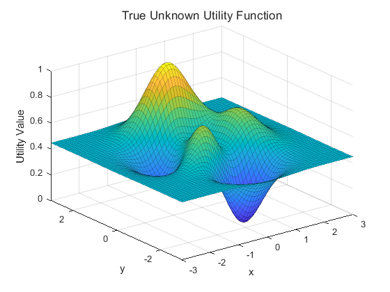
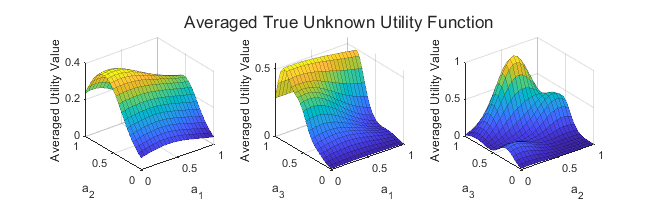
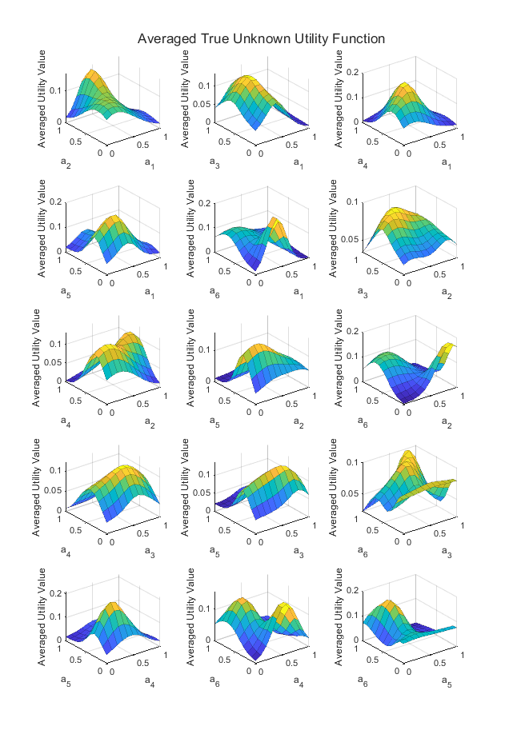

POLAR includes four example learning environments. Each of these examples includes a 'setupLearning' function that defines an action space as well as various learning parameters. Each example also includes a 'ObjectiveFunction' function that defines a corresponding underlying objective function that can be used to simulate the learning procedure. 
{:notoc}

<details open markdown="block">
  <summary>
    Table of contents
  </summary>
  {: .text-delta }
1. TOC
{:toc}
</details>

### 1D Function
{:toc}
This one dimensional function is one of the simplest examples included in the toolbox. An action in this environment is the scalar $a \in \mathbb{R}$. The objective function provided for the 1D function is:

$$ f(a) = -\exp(a)\sin(2 \pi a) $$

To load the 1D Function example run the command:
```
alg = loadExample('1D Function');
```
To plot the underlying utility function provided in 'ObjectiveFunction' (also shown in the figure below) run:
```
alg.plotTrueObjective;
```
{:refdef: style="text-align: center;"}

{: refdef}

### 2D Surface
{:toc}
This setting is the two dimensional surface as defined by the MATLAB function 'peaks'. An action for this example is defined as $a := [a_1, a_2] \in \mathbb{R}^2$ and takes values between -3 and 3. The objective function is defined as:

$$ f(a) = 3(1-a_1)^2 \exp(-a_1^2 - (a_2+1)^2) - 10(\frac{a_1}{5} - a_1^3 - a_2^5)\exp(a_1^2 - a_2^2) - \frac{1}{3} \exp(-(a_1^2 - a_2^2) $$

To load the 2D surface example run the command:
```
alg = loadExample('peaks');
```
To plot the underlying utility function provided in 'ObjectiveFunction' (also shown in the figure below) run:
```
alg.plotTrueObjective;
```
{:refdef: style="text-align: center;"}

{: refdef}

### Hartmann3
{:toc}
The [Hartmann 3-dimensional function](https://www.sfu.ca/~ssurjano/hart3.html) (nicknamed Hartmann3) is a standard high-dimensional test function. Actions are defined as $a_i \in (0,1)$ for all $i = [1,2,3]$.  The Hartmann3 function was originally constructed for use with minimization problems. However, since POLAR regret-minimization simulations are designed to identify the action with the highest objective value, we negate the Hartmann3 function. This negated objective function is defined as:

$$
\begin{align*}
f(a) = &\sum_{i = 1}^{4} \alpha_i \exp\left(-\sum_{j=1}^3 A_{ij} (a_j - P_{ij}^2)\right) \\
&\alpha = (1.0, 1.2, 3.0, 3.2)^T \\
&A = \begin{pmatrix} 3.0 & 10 & 30 \\ 0.1 & 10 & 35 \\ 3.0 & 10 & 30 \\ 0.1 & 10 & 35 \end{pmatrix} \\
&P = 10^{-4} \begin{pmatrix} 3689 & 1170 & 2673 \\ 4699 & 4387 & 7470 \\ 1091 & 8732 & 5547 \\ 381 & 5743 & 8828 \end{pmatrix}
\end{align*} 
$$

To load the Hartmann3 example run the command:
```
alg = loadExample('Hartmann3');
```
To plot the underlying utility function provided in 'ObjectiveFunction' (also shown in the figure below) run:
```
alg.plotTrueObjective;
```
{:refdef: style="text-align: center;"}

{: refdef}

### Hartmann6
{:toc}

The [Hartmann 6-dimensional function](https://www.sfu.ca/~ssurjano/hart6.html) (nicknamed Hartmann6) is another standard high-dimensional test function. Actions are defined as $a_i \in (0,1)$ for all $i = [1,\dots,6]$.  As with the Hartmann3 function, we negate the Hartmann6 function with the aim of identifying the action with the maximum utility during regret minimization. This negated objective function is defined as:

$$
\begin{align*}
f(a) = &\sum_{i = 1}^{4} \alpha_i \exp\left(-\sum_{j=1}^6 A_{ij} (a_j - P_{ij}^2)\right) \\
&\alpha = (1.0, 1.2, 3.0, 3.2)^T \\
&A = \begin{pmatrix} 10 & 3 & 17 & 3.50 & 1.7 & 8 \\ 0.05 & 10 & 17 & 0.1 & 8 & 14 \\ 3 & 3.5 & 1.7 & 10 & 17 & 8 \\ 17 & 8 & 0.05 & 10 & 0.1 & 14 \end{pmatrix} \\
&P = 10^{-4} \begin{pmatrix} 1312 & 1696 & 5569 & 124 & 8283 & 5886 \\
    2329 & 4135 & 8307 & 3736 & 1004 & 9991 \\
    2348 & 1451 & 3522 & 2883 & 3047 & 6650 \\
    4047 & 8828 & 8732 & 5743 & 1091 & 381 \end{pmatrix}
\end{align*} 
$$

To load the Hartmann6 example run the command:
```
alg = loadExample('Hartmann6');
```
To plot the underlying utility function provided in 'ObjectiveFunction' (also shown in the figure below) run:
```
alg.plotTrueObjective;
```
{:refdef: style="text-align: center;"}

{: refdef}