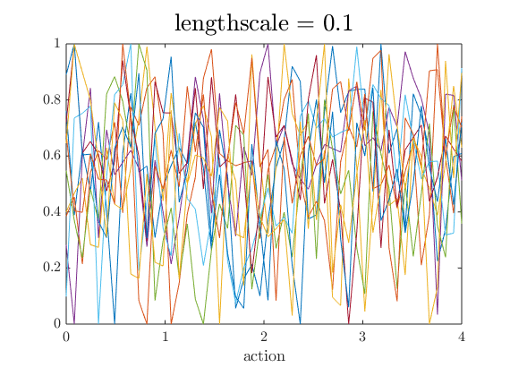
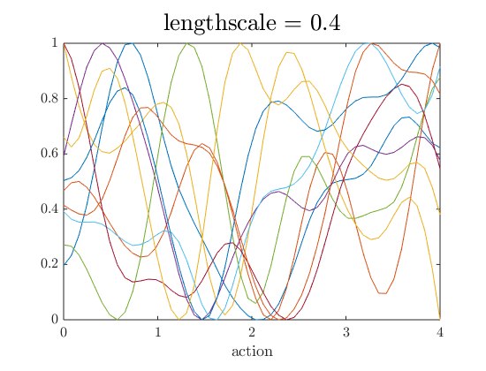
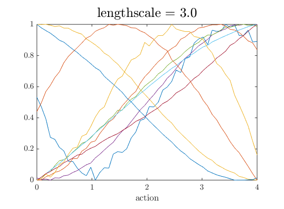
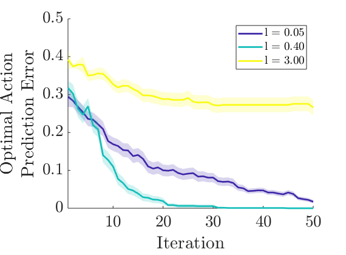

There are several hyperparameters used in POLAR. Including the following major hyperparameters: 

  

    Contents
  

  {: .text-delta }
1. TOC
{:toc}

In this tutorial we discuss methods of tuning these hyperparameters.

## Lengthscales

The following is an example of three different lengthscales for the `1D Function` example in the POLAR toolbox:

  

    
    
    
  

Within the `1D Function` example folder, there is a script called `how_to_tune_lengthscale.m` that demonstrates the effect of the lengthscale on the learning performance: 

As shown by the figure, too small of a lengthscale results in a slower learning rate, while too large of a lengthscale results in overly-confident assumptions about the underlying optimal action.

## GP Noise Variance

## GP Feedback Noise

## Upper Confidence Bound for Region of Avoidance
This setting is stored in the learning algorithm as ``settings.roa.lambda`` and appears in the equation used to estimate the region of avoidance.